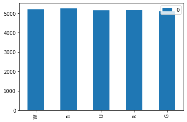
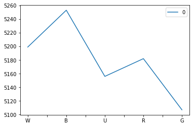
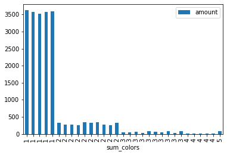
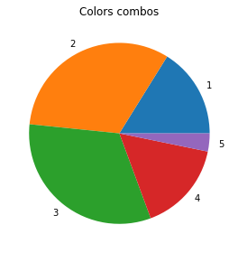
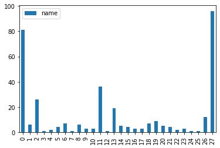

```python
import numpy as np # linear algebra
import pandas as pd # data processing, CSV file I/O (e.g. pd.read_csv)
import matplotlib as mpl
import matplotlib.pyplot as plt
import seaborn as sns
import warnings; warnings.filterwarnings(action='once')
import re
import json

# plotly
# import plotly.plotly as py
from plotly.offline import init_notebook_mode, iplot, plot
import plotly as py
init_notebook_mode(connected=True)
import plotly.graph_objs as go
```


<script type="text/javascript">
window.PlotlyConfig = {MathJaxConfig: 'local'};
if (window.MathJax) {MathJax.Hub.Config({SVG: {font: "STIX-Web"}});}
if (typeof require !== 'undefined') {
require.undef("plotly");
requirejs.config({
    paths: {
        'plotly': ['https://cdn.plot.ly/plotly-latest.min']
    }
});
require(['plotly'], function(Plotly) {
    window._Plotly = Plotly;
});
}
</script>


Перед вами набор данных, который содержит все когда-либо выпущенные карты Magic: The Gathering. Для большего понимания, о чем идет речь, вы можете перейти на официальный сайт игры и ознакомиться с базовыми правилами.

 
На основе этих данных составьте отчет, который будет содержать следующую информацию:

 
1) Распределение карт по цвету в зависимости от редкости.

2) Процент карт, запрещенных в формате Commander, а также распределение по типу для этих карт.

3) Топ-10 карт, не являющихся землями, которые были напечатаны в наибольшем количестве сетов.

4) Для карт, не являющихся землями, определите, какая часть из них даёт ману с помощью своего эффекта. Покажите распределение по типу маны, который дают эти карты. 


```python
df = pd.read_csv('/mnt/HC_Volume_18315164/home-jupyter/jupyter-j-postnova/Magic/all_mtg_cards.csv', error_bad_lines=False, engine="python")
```

    Skipping line 66241: unexpected end of data


```python
df.head(2)
```


<div>
<style scoped>
    .dataframe tbody tr th:only-of-type {
        vertical-align: middle;
    }

    .dataframe tbody tr th {
        vertical-align: top;
    }

    .dataframe thead th {
        text-align: right;
    }
</style>
<table border="1" class="dataframe">
  <thead>
    <tr style="text-align: right;">
      <th></th>
      <th>name</th>
      <th>multiverse_id</th>
      <th>layout</th>
      <th>names</th>
      <th>mana_cost</th>
      <th>cmc</th>
      <th>colors</th>
      <th>color_identity</th>
      <th>type</th>
      <th>supertypes</th>
      <th>...</th>
      <th>foreign_names</th>
      <th>printings</th>
      <th>original_text</th>
      <th>original_type</th>
      <th>legalities</th>
      <th>source</th>
      <th>image_url</th>
      <th>set</th>
      <th>set_name</th>
      <th>id</th>
    </tr>
  </thead>
  <tbody>
    <tr>
      <th>0</th>
      <td>Ancestor's Chosen</td>
      <td>130550.0</td>
      <td>normal</td>
      <td>NaN</td>
      <td>{5}{W}{W}</td>
      <td>7.0</td>
      <td>['White']</td>
      <td>['W']</td>
      <td>Creature — Human Cleric</td>
      <td>NaN</td>
      <td>...</td>
      <td>[{'name': 'Ausgewählter der Ahnfrau', 'text': ...</td>
      <td>['10E', 'JUD', 'UMA']</td>
      <td>First strike (This creature deals combat damag...</td>
      <td>Creature - Human Cleric</td>
      <td>[{'format': 'Commander', 'legality': 'Legal'},...</td>
      <td>NaN</td>
      <td>http://gatherer.wizards.com/Handlers/Image.ash...</td>
      <td>10E</td>
      <td>Tenth Edition</td>
      <td>5f8287b1-5bb6-5f4c-ad17-316a40d5bb0c</td>
    </tr>
    <tr>
      <th>1</th>
      <td>Ancestor's Chosen</td>
      <td>NaN</td>
      <td>normal</td>
      <td>NaN</td>
      <td>{5}{W}{W}</td>
      <td>7.0</td>
      <td>['White']</td>
      <td>['W']</td>
      <td>Creature — Human Cleric</td>
      <td>NaN</td>
      <td>...</td>
      <td>NaN</td>
      <td>['10E', 'JUD', 'UMA']</td>
      <td>NaN</td>
      <td>NaN</td>
      <td>[{'format': 'Commander', 'legality': 'Legal'},...</td>
      <td>NaN</td>
      <td>NaN</td>
      <td>10E</td>
      <td>Tenth Edition</td>
      <td>b7c19924-b4bf-56fc-aa73-f586e940bd42</td>
    </tr>
  </tbody>
</table>
<p>2 rows × 39 columns</p>
</div>


```python
#посмотрим информацию о данных
df.info()
```

    <class 'pandas.core.frame.DataFrame'>
    RangeIndex: 66239 entries, 0 to 66238
    Data columns (total 39 columns):
     #   Column          Non-Null Count  Dtype  
    ---  ------          --------------  -----  
     0   name            66239 non-null  object 
     1   multiverse_id   46961 non-null  float64
     2   layout          66239 non-null  object 
     3   names           0 non-null      float64
     4   mana_cost       57713 non-null  object 
     5   cmc             66239 non-null  float64
     6   colors          52258 non-null  object 
     7   color_identity  59267 non-null  object 
     8   type            66239 non-null  object 
     9   supertypes      9839 non-null   object 
     10  subtypes        40625 non-null  object 
     11  rarity          66239 non-null  object 
     12  text            65277 non-null  object 
     13  flavor          34154 non-null  object 
     14  artist          66228 non-null  object 
     15  number          66239 non-null  object 
     16  power           31103 non-null  object 
     17  toughness       31103 non-null  object 
     18  loyalty         1068 non-null   object 
     19  variations      12326 non-null  object 
     20  watermark       5105 non-null   object 
     21  border          0 non-null      float64
     22  timeshifted     0 non-null      float64
     23  hand            119 non-null    float64
     24  life            119 non-null    float64
     25  reserved        0 non-null      float64
     26  release_date    0 non-null      float64
     27  starter         0 non-null      float64
     28  rulings         36826 non-null  object 
     29  foreign_names   40803 non-null  object 
     30  printings       66239 non-null  object 
     31  original_text   46014 non-null  object 
     32  original_type   46941 non-null  object 
     33  legalities      64849 non-null  object 
     34  source          0 non-null      float64
     35  image_url       46961 non-null  object 
     36  set             66239 non-null  object 
     37  set_name        66239 non-null  object 
     38  id              66239 non-null  object 
    dtypes: float64(11), object(28)
    memory usage: 19.7+ MB


```python
#информация о цвете карт находится в двух столбцах: colors и color_identity, название карты в столбце name
#из данныхпо таблице сразу видно, что имен гораздо больше, чем цветов, также у многих карт нет значения colors, 
#но есть значение color_identity
#имена карт повторяются
```


```python
#имена карт повторяются, посомтрим, сколько уникальных имен
df.name.nunique()
```


    23960


```python
#хорошо, тогда если взять уникальные имена, сколько значений будет иметь информацию о colors или color_identity?
```


```python
df_colors = df.query("colors.notnull()")
df_colors.name.nunique()
```


    20582


```python
df_color_identity = df.query("color_identity.notnull()")
df_color_identity.name.nunique()
```


    21481


```python
#отлично, тогда возьмем лучшее из имеющегося. Объединим df_color_identity and df_colors и уберем дубликаты по имени
```


```python
df_merged = df_colors.merge(df_color_identity, how = 'outer').drop_duplicates(subset='name')
```


```python
#таблица df_merged содержит столько же строк, сколько и df_color_identity, это значит, 
#что у каждого уникального имени точно есть color_identity - с ним и будем работать
```


```python
df_name_color = df_merged[['name','color_identity']]
# оставить только нужные столбцы 
```


```python
df_name_color = df_name_color.reset_index(drop=True) #сбросить индексы строк, чтобы итеррироваться по ним
```


```python
# used to convert a string column to a list of the strings
def str_to_list(cell):
    cell = ''.join(c for c in cell if c not in "'[]")
    cell = cell.split(', ')
    return cell
```


```python
for i in range(len(df_name_color.color_identity)):
    df_name_color.color_identity[i] = str_to_list(df_name_color.color_identity[i])
```

# 1) Распределение карт по цвету в зависимости от редкости.


```python
df_name_color.color_identity[21476][3]
```


    'U'


```python
df_name_color.insert(2, "W", 0)
df_name_color.insert(3, "B", 0)
df_name_color.insert(4, "U", 0)
df_name_color.insert(5, "R", 0)
df_name_color.insert(6, "G", 0)
# добавимнеобходимые столбцы вдатафрейм
```


```python
df_name_color['W'][1]
```


    0


```python
for i in range(len(df_name_color.color_identity)):
    if 'W' in df_name_color.color_identity[i]:
        df_name_color.W[i] = 1
    if 'B' in df_name_color.color_identity[i]:
        df_name_color.B[i] = 1
    if 'U' in df_name_color.color_identity[i]:
        df_name_color.U[i] = 1
    if 'R' in df_name_color.color_identity[i]:
        df_name_color.R[i] = 1
    if 'G' in df_name_color.color_identity[i]:
        df_name_color.G[i] = 1
```

    /opt/tljh/user/lib/python3.7/site-packages/ipykernel_launcher.py:3: SettingWithCopyWarning:
    
    
    A value is trying to be set on a copy of a slice from a DataFrame
    
    See the caveats in the documentation: https://pandas.pydata.org/pandas-docs/stable/user_guide/indexing.html#returning-a-view-versus-a-copy
    


```python
df_name_color
```


<div>
<style scoped>
    .dataframe tbody tr th:only-of-type {
        vertical-align: middle;
    }

    .dataframe tbody tr th {
        vertical-align: top;
    }

    .dataframe thead th {
        text-align: right;
    }
</style>
<table border="1" class="dataframe">
  <thead>
    <tr style="text-align: right;">
      <th></th>
      <th>name</th>
      <th>color_identity</th>
      <th>W</th>
      <th>B</th>
      <th>U</th>
      <th>R</th>
      <th>G</th>
    </tr>
  </thead>
  <tbody>
    <tr>
      <th>0</th>
      <td>Ancestor's Chosen</td>
      <td>[W]</td>
      <td>1</td>
      <td>0</td>
      <td>0</td>
      <td>0</td>
      <td>0</td>
    </tr>
    <tr>
      <th>1</th>
      <td>Angel of Mercy</td>
      <td>[W]</td>
      <td>1</td>
      <td>0</td>
      <td>0</td>
      <td>0</td>
      <td>0</td>
    </tr>
    <tr>
      <th>2</th>
      <td>Angelic Blessing</td>
      <td>[W]</td>
      <td>1</td>
      <td>0</td>
      <td>0</td>
      <td>0</td>
      <td>0</td>
    </tr>
    <tr>
      <th>3</th>
      <td>Angelic Chorus</td>
      <td>[W]</td>
      <td>1</td>
      <td>0</td>
      <td>0</td>
      <td>0</td>
      <td>0</td>
    </tr>
    <tr>
      <th>4</th>
      <td>Angelic Wall</td>
      <td>[W]</td>
      <td>1</td>
      <td>0</td>
      <td>0</td>
      <td>0</td>
      <td>0</td>
    </tr>
    <tr>
      <th>...</th>
      <td>...</td>
      <td>...</td>
      <td>...</td>
      <td>...</td>
      <td>...</td>
      <td>...</td>
      <td>...</td>
    </tr>
    <tr>
      <th>21476</th>
      <td>Jack-in-the-Mox</td>
      <td>[B, G, R, U, W]</td>
      <td>1</td>
      <td>1</td>
      <td>1</td>
      <td>1</td>
      <td>1</td>
    </tr>
    <tr>
      <th>21477</th>
      <td>Serra's Sanctum</td>
      <td>[W]</td>
      <td>1</td>
      <td>0</td>
      <td>0</td>
      <td>0</td>
      <td>0</td>
    </tr>
    <tr>
      <th>21478</th>
      <td>Sap Sucker</td>
      <td>[G]</td>
      <td>0</td>
      <td>0</td>
      <td>0</td>
      <td>0</td>
      <td>1</td>
    </tr>
    <tr>
      <th>21479</th>
      <td>Magosi, the Waterveil</td>
      <td>[U]</td>
      <td>0</td>
      <td>0</td>
      <td>1</td>
      <td>0</td>
      <td>0</td>
    </tr>
    <tr>
      <th>21480</th>
      <td>Piranha Marsh</td>
      <td>[B]</td>
      <td>0</td>
      <td>1</td>
      <td>0</td>
      <td>0</td>
      <td>0</td>
    </tr>
  </tbody>
</table>
<p>21481 rows × 7 columns</p>
</div>


```python

```


```python
df_name_color_sum = pd.DataFrame(df_name_color[['W','B','U','R','G']].sum())
df_name_color_sum.plot.bar()
```


    <matplotlib.axes._subplots.AxesSubplot at 0x7fba680eda90>





```python
df_name_color_sum.plot()
```


    <matplotlib.axes._subplots.AxesSubplot at 0x7fba680ba1d0>





```python
W_dif = 100 - df_name_color_sum.loc['W']/df_name_color_sum.max()*100
B_dif = 100 - df_name_color_sum.loc['B']/df_name_color_sum.max()*100
U_dif = 100 - df_name_color_sum.loc['U']/df_name_color_sum.max()*100
R_dif = 100 - df_name_color_sum.loc['R']/df_name_color_sum.max()*100
G_dif = 100 - df_name_color_sum.loc['G']/df_name_color_sum.max()*100
```


```python
W_dif, B_dif, U_dif, R_dif, G_dif #разница между макисмальным значением и остальными впроцентах
```


    (0    1.027984
     dtype: float64,
     0    0.0
     dtype: float64,
     0    1.846564
     dtype: float64,
     0    1.351609
     dtype: float64,
     0    2.779364
     dtype: float64)


# На основе полученных данных можно сказать, что пристуствие каждого цвета в картах распределно равномерно, максимальная разница в количестве между двумя цветами 2,77%. 

Это, вероятно не новость, скорее всего так и задумано игрой, что все цвета должны быть примерно в одинаковом количестве. Тем не менее, такой анализ может быть полезен например в случае выпуска новой колекции карт, для того, чтобы уровнять количество задействованных цветов, или для того, чтобы убедится, что разбивка по цветам происходит правильно.

Также интересно посомтреть, как распределяются __комбинации__ этих цветов в картах


```python
# Для этого вернемсяк датафрейму df_merged
```


```python
df_color_combo = df_merged[['name','color_identity']] 
# возьмем нужные столбцы
```


```python
df_color_combo
```


<div>
<style scoped>
    .dataframe tbody tr th:only-of-type {
        vertical-align: middle;
    }

    .dataframe tbody tr th {
        vertical-align: top;
    }

    .dataframe thead th {
        text-align: right;
    }
</style>
<table border="1" class="dataframe">
  <thead>
    <tr style="text-align: right;">
      <th></th>
      <th>name</th>
      <th>color_identity</th>
    </tr>
  </thead>
  <tbody>
    <tr>
      <th>0</th>
      <td>Ancestor's Chosen</td>
      <td>['W']</td>
    </tr>
    <tr>
      <th>2</th>
      <td>Angel of Mercy</td>
      <td>['W']</td>
    </tr>
    <tr>
      <th>4</th>
      <td>Angelic Blessing</td>
      <td>['W']</td>
    </tr>
    <tr>
      <th>6</th>
      <td>Angelic Chorus</td>
      <td>['W']</td>
    </tr>
    <tr>
      <th>7</th>
      <td>Angelic Wall</td>
      <td>['W']</td>
    </tr>
    <tr>
      <th>...</th>
      <td>...</td>
      <td>...</td>
    </tr>
    <tr>
      <th>58703</th>
      <td>Jack-in-the-Mox</td>
      <td>['B', 'G', 'R', 'U', 'W']</td>
    </tr>
    <tr>
      <th>58766</th>
      <td>Serra's Sanctum</td>
      <td>['W']</td>
    </tr>
    <tr>
      <th>58791</th>
      <td>Sap Sucker</td>
      <td>['G']</td>
    </tr>
    <tr>
      <th>59219</th>
      <td>Magosi, the Waterveil</td>
      <td>['U']</td>
    </tr>
    <tr>
      <th>59221</th>
      <td>Piranha Marsh</td>
      <td>['B']</td>
    </tr>
  </tbody>
</table>
<p>21481 rows × 2 columns</p>
</div>


```python
# сгруппируем по color_identity и посчитаем количество
df_color_combo_amount = df_color_combo.groupby('color_identity')\
    .count()\
    .reset_index()\
    .rename(columns = {'name':'amount'})\
    .sort_values('color_identity', ascending=True)

df_color_combo_amount
```


<div>
<style scoped>
    .dataframe tbody tr th:only-of-type {
        vertical-align: middle;
    }

    .dataframe tbody tr th {
        vertical-align: top;
    }

    .dataframe thead th {
        text-align: right;
    }
</style>
<table border="1" class="dataframe">
  <thead>
    <tr style="text-align: right;">
      <th></th>
      <th>color_identity</th>
      <th>amount</th>
    </tr>
  </thead>
  <tbody>
    <tr>
      <th>0</th>
      <td>['B', 'G', 'R', 'U', 'W']</td>
      <td>81</td>
    </tr>
    <tr>
      <th>1</th>
      <td>['B', 'G', 'R', 'U']</td>
      <td>2</td>
    </tr>
    <tr>
      <th>2</th>
      <td>['B', 'G', 'R', 'W']</td>
      <td>2</td>
    </tr>
    <tr>
      <th>3</th>
      <td>['B', 'G', 'R']</td>
      <td>73</td>
    </tr>
    <tr>
      <th>4</th>
      <td>['B', 'G', 'U', 'W']</td>
      <td>3</td>
    </tr>
    <tr>
      <th>5</th>
      <td>['B', 'G', 'U']</td>
      <td>40</td>
    </tr>
    <tr>
      <th>6</th>
      <td>['B', 'G', 'W']</td>
      <td>32</td>
    </tr>
    <tr>
      <th>7</th>
      <td>['B', 'G']</td>
      <td>276</td>
    </tr>
    <tr>
      <th>8</th>
      <td>['B', 'R', 'U', 'W']</td>
      <td>2</td>
    </tr>
    <tr>
      <th>9</th>
      <td>['B', 'R', 'U']</td>
      <td>79</td>
    </tr>
    <tr>
      <th>10</th>
      <td>['B', 'R', 'W']</td>
      <td>43</td>
    </tr>
    <tr>
      <th>11</th>
      <td>['B', 'R']</td>
      <td>334</td>
    </tr>
    <tr>
      <th>12</th>
      <td>['B', 'U', 'W']</td>
      <td>67</td>
    </tr>
    <tr>
      <th>13</th>
      <td>['B', 'U']</td>
      <td>333</td>
    </tr>
    <tr>
      <th>14</th>
      <td>['B', 'W']</td>
      <td>265</td>
    </tr>
    <tr>
      <th>15</th>
      <td>['B']</td>
      <td>3621</td>
    </tr>
    <tr>
      <th>16</th>
      <td>['G', 'R', 'U', 'W']</td>
      <td>3</td>
    </tr>
    <tr>
      <th>17</th>
      <td>['G', 'R', 'U']</td>
      <td>32</td>
    </tr>
    <tr>
      <th>18</th>
      <td>['G', 'R', 'W']</td>
      <td>76</td>
    </tr>
    <tr>
      <th>19</th>
      <td>['G', 'R']</td>
      <td>323</td>
    </tr>
    <tr>
      <th>20</th>
      <td>['G', 'U', 'W']</td>
      <td>68</td>
    </tr>
    <tr>
      <th>21</th>
      <td>['G', 'U']</td>
      <td>253</td>
    </tr>
    <tr>
      <th>22</th>
      <td>['G', 'W']</td>
      <td>324</td>
    </tr>
    <tr>
      <th>23</th>
      <td>['G']</td>
      <td>3519</td>
    </tr>
    <tr>
      <th>24</th>
      <td>['R', 'U', 'W']</td>
      <td>39</td>
    </tr>
    <tr>
      <th>25</th>
      <td>['R', 'U']</td>
      <td>254</td>
    </tr>
    <tr>
      <th>26</th>
      <td>['R', 'W']</td>
      <td>264</td>
    </tr>
    <tr>
      <th>27</th>
      <td>['R']</td>
      <td>3575</td>
    </tr>
    <tr>
      <th>28</th>
      <td>['U', 'W']</td>
      <td>332</td>
    </tr>
    <tr>
      <th>29</th>
      <td>['U']</td>
      <td>3568</td>
    </tr>
    <tr>
      <th>30</th>
      <td>['W']</td>
      <td>3598</td>
    </tr>
  </tbody>
</table>
</div>


```python
# посчитаем количество элементов в списке
# NB!!! поскольку на данный моент в столбце находится строка, и для того, чтобы посчитать количество
# элементов нужно распарсить ее в список, проще посчитать количество разделителейи прибавить еще 1
df_color_combo_amount['sum_colors'] = 0 
for i in range(len(df_color_combo_amount.color_identity)):
    df_color_combo_amount['sum_colors'][i] =  df_color_combo_amount.color_identity[i].count(',') + 1
```

    /opt/tljh/user/lib/python3.7/site-packages/ipykernel_launcher.py:6: SettingWithCopyWarning:
    
    
    A value is trying to be set on a copy of a slice from a DataFrame
    
    See the caveats in the documentation: https://pandas.pydata.org/pandas-docs/stable/user_guide/indexing.html#returning-a-view-versus-a-copy
    


```python
df_color_combo_amount = df_color_combo_amount.set_index('sum_colors')
# устанвить количество элементов списке цветов индексом
```


```python
df_color_combo_amount = df_color_combo_amount.sort_values('sum_colors', ascending=True)
# сортировка по индексу
```


```python
df_color_combo_amount.plot.bar()
```


    <matplotlib.axes._subplots.AxesSubplot at 0x7fba6802aef0>





Из барплота видно, что самая большая доля карт приходится на карты с 1 цветом, затем количество карт уменьшается с увеличением количества цветов, но интересно, что карт с количеством цветов 5 больше, чем карт с количеством цветов 4.

Также можно посомтреть, какую долю занимают комбинации с разным количество цветов в игре


```python
df_2 = df_color_combo_amount.reset_index()
df_2
```


<div>
<style scoped>
    .dataframe tbody tr th:only-of-type {
        vertical-align: middle;
    }

    .dataframe tbody tr th {
        vertical-align: top;
    }

    .dataframe thead th {
        text-align: right;
    }
</style>
<table border="1" class="dataframe">
  <thead>
    <tr style="text-align: right;">
      <th></th>
      <th>sum_colors</th>
      <th>color_identity</th>
      <th>amount</th>
    </tr>
  </thead>
  <tbody>
    <tr>
      <th>0</th>
      <td>1</td>
      <td>['B']</td>
      <td>3621</td>
    </tr>
    <tr>
      <th>1</th>
      <td>1</td>
      <td>['R']</td>
      <td>3575</td>
    </tr>
    <tr>
      <th>2</th>
      <td>1</td>
      <td>['G']</td>
      <td>3519</td>
    </tr>
    <tr>
      <th>3</th>
      <td>1</td>
      <td>['U']</td>
      <td>3568</td>
    </tr>
    <tr>
      <th>4</th>
      <td>1</td>
      <td>['W']</td>
      <td>3598</td>
    </tr>
    <tr>
      <th>5</th>
      <td>2</td>
      <td>['U', 'W']</td>
      <td>332</td>
    </tr>
    <tr>
      <th>6</th>
      <td>2</td>
      <td>['B', 'G']</td>
      <td>276</td>
    </tr>
    <tr>
      <th>7</th>
      <td>2</td>
      <td>['R', 'W']</td>
      <td>264</td>
    </tr>
    <tr>
      <th>8</th>
      <td>2</td>
      <td>['R', 'U']</td>
      <td>254</td>
    </tr>
    <tr>
      <th>9</th>
      <td>2</td>
      <td>['B', 'R']</td>
      <td>334</td>
    </tr>
    <tr>
      <th>10</th>
      <td>2</td>
      <td>['G', 'W']</td>
      <td>324</td>
    </tr>
    <tr>
      <th>11</th>
      <td>2</td>
      <td>['B', 'U']</td>
      <td>333</td>
    </tr>
    <tr>
      <th>12</th>
      <td>2</td>
      <td>['B', 'W']</td>
      <td>265</td>
    </tr>
    <tr>
      <th>13</th>
      <td>2</td>
      <td>['G', 'U']</td>
      <td>253</td>
    </tr>
    <tr>
      <th>14</th>
      <td>2</td>
      <td>['G', 'R']</td>
      <td>323</td>
    </tr>
    <tr>
      <th>15</th>
      <td>3</td>
      <td>['B', 'G', 'U']</td>
      <td>40</td>
    </tr>
    <tr>
      <th>16</th>
      <td>3</td>
      <td>['R', 'U', 'W']</td>
      <td>39</td>
    </tr>
    <tr>
      <th>17</th>
      <td>3</td>
      <td>['G', 'U', 'W']</td>
      <td>68</td>
    </tr>
    <tr>
      <th>18</th>
      <td>3</td>
      <td>['G', 'R', 'U']</td>
      <td>32</td>
    </tr>
    <tr>
      <th>19</th>
      <td>3</td>
      <td>['B', 'G', 'R']</td>
      <td>73</td>
    </tr>
    <tr>
      <th>20</th>
      <td>3</td>
      <td>['B', 'U', 'W']</td>
      <td>67</td>
    </tr>
    <tr>
      <th>21</th>
      <td>3</td>
      <td>['B', 'R', 'W']</td>
      <td>43</td>
    </tr>
    <tr>
      <th>22</th>
      <td>3</td>
      <td>['B', 'R', 'U']</td>
      <td>79</td>
    </tr>
    <tr>
      <th>23</th>
      <td>3</td>
      <td>['B', 'G', 'W']</td>
      <td>32</td>
    </tr>
    <tr>
      <th>24</th>
      <td>3</td>
      <td>['G', 'R', 'W']</td>
      <td>76</td>
    </tr>
    <tr>
      <th>25</th>
      <td>4</td>
      <td>['B', 'G', 'U', 'W']</td>
      <td>3</td>
    </tr>
    <tr>
      <th>26</th>
      <td>4</td>
      <td>['G', 'R', 'U', 'W']</td>
      <td>3</td>
    </tr>
    <tr>
      <th>27</th>
      <td>4</td>
      <td>['B', 'G', 'R', 'W']</td>
      <td>2</td>
    </tr>
    <tr>
      <th>28</th>
      <td>4</td>
      <td>['B', 'R', 'U', 'W']</td>
      <td>2</td>
    </tr>
    <tr>
      <th>29</th>
      <td>4</td>
      <td>['B', 'G', 'R', 'U']</td>
      <td>2</td>
    </tr>
    <tr>
      <th>30</th>
      <td>5</td>
      <td>['B', 'G', 'R', 'U', 'W']</td>
      <td>81</td>
    </tr>
  </tbody>
</table>
</div>


```python
df_pie = df_2.groupby('sum_colors', as_index=False).count()
df_pie
```


<div>
<style scoped>
    .dataframe tbody tr th:only-of-type {
        vertical-align: middle;
    }

    .dataframe tbody tr th {
        vertical-align: top;
    }

    .dataframe thead th {
        text-align: right;
    }
</style>
<table border="1" class="dataframe">
  <thead>
    <tr style="text-align: right;">
      <th></th>
      <th>sum_colors</th>
      <th>color_identity</th>
      <th>amount</th>
    </tr>
  </thead>
  <tbody>
    <tr>
      <th>0</th>
      <td>1</td>
      <td>5</td>
      <td>5</td>
    </tr>
    <tr>
      <th>1</th>
      <td>2</td>
      <td>10</td>
      <td>10</td>
    </tr>
    <tr>
      <th>2</th>
      <td>3</td>
      <td>10</td>
      <td>10</td>
    </tr>
    <tr>
      <th>3</th>
      <td>4</td>
      <td>5</td>
      <td>5</td>
    </tr>
    <tr>
      <th>4</th>
      <td>5</td>
      <td>1</td>
      <td>1</td>
    </tr>
  </tbody>
</table>
</div>


```python
df_pie.color_identity.sum()
```


    31


```python
df_pie['part'] = df_pie['amount'] / 31 *100
```


```python
# df_pie.set_index('color_identity')
```


```python
df_pie
```


<div>
<style scoped>
    .dataframe tbody tr th:only-of-type {
        vertical-align: middle;
    }

    .dataframe tbody tr th {
        vertical-align: top;
    }

    .dataframe thead th {
        text-align: right;
    }
</style>
<table border="1" class="dataframe">
  <thead>
    <tr style="text-align: right;">
      <th></th>
      <th>sum_colors</th>
      <th>color_identity</th>
      <th>amount</th>
      <th>part</th>
    </tr>
  </thead>
  <tbody>
    <tr>
      <th>0</th>
      <td>1</td>
      <td>5</td>
      <td>5</td>
      <td>16.129032</td>
    </tr>
    <tr>
      <th>1</th>
      <td>2</td>
      <td>10</td>
      <td>10</td>
      <td>32.258065</td>
    </tr>
    <tr>
      <th>2</th>
      <td>3</td>
      <td>10</td>
      <td>10</td>
      <td>32.258065</td>
    </tr>
    <tr>
      <th>3</th>
      <td>4</td>
      <td>5</td>
      <td>5</td>
      <td>16.129032</td>
    </tr>
    <tr>
      <th>4</th>
      <td>5</td>
      <td>1</td>
      <td>1</td>
      <td>3.225806</td>
    </tr>
  </tbody>
</table>
</div>


```python
x = df_pie.amount
labels = df_pie.sum_colors

fig, ax = plt.subplots()
ax.pie(x, labels=labels)
ax.set_title('Colors combos')
plt.tight_layout()
```





# 2) Процент карт, запрещенных в формате Commander, а также распределение по типу для этих карт.


```python
# данные по форматам хранятся в столбце legalities
# посмотрим на них
```


```python
df.info()
```

    <class 'pandas.core.frame.DataFrame'>
    RangeIndex: 66239 entries, 0 to 66238
    Data columns (total 39 columns):
     #   Column          Non-Null Count  Dtype  
    ---  ------          --------------  -----  
     0   name            66239 non-null  object 
     1   multiverse_id   46961 non-null  float64
     2   layout          66239 non-null  object 
     3   names           0 non-null      float64
     4   mana_cost       57713 non-null  object 
     5   cmc             66239 non-null  float64
     6   colors          52258 non-null  object 
     7   color_identity  59267 non-null  object 
     8   type            66239 non-null  object 
     9   supertypes      9839 non-null   object 
     10  subtypes        40625 non-null  object 
     11  rarity          66239 non-null  object 
     12  text            65277 non-null  object 
     13  flavor          34154 non-null  object 
     14  artist          66228 non-null  object 
     15  number          66239 non-null  object 
     16  power           31103 non-null  object 
     17  toughness       31103 non-null  object 
     18  loyalty         1068 non-null   object 
     19  variations      12326 non-null  object 
     20  watermark       5105 non-null   object 
     21  border          0 non-null      float64
     22  timeshifted     0 non-null      float64
     23  hand            119 non-null    float64
     24  life            119 non-null    float64
     25  reserved        0 non-null      float64
     26  release_date    0 non-null      float64
     27  starter         0 non-null      float64
     28  rulings         36826 non-null  object 
     29  foreign_names   40803 non-null  object 
     30  printings       66239 non-null  object 
     31  original_text   46014 non-null  object 
     32  original_type   46941 non-null  object 
     33  legalities      64849 non-null  object 
     34  source          0 non-null      float64
     35  image_url       46961 non-null  object 
     36  set             66239 non-null  object 
     37  set_name        66239 non-null  object 
     38  id              66239 non-null  object 
    dtypes: float64(11), object(28)
    memory usage: 19.7+ MB


```python
# В данных есть нулевые строки, уберем их
```


```python
df2 = df.query("legalities.notnull()").reset_index() #сбросить индекс, чтобы итерироваться по фрейму
df2.head(2)
```


<div>
<style scoped>
    .dataframe tbody tr th:only-of-type {
        vertical-align: middle;
    }

    .dataframe tbody tr th {
        vertical-align: top;
    }

    .dataframe thead th {
        text-align: right;
    }
</style>
<table border="1" class="dataframe">
  <thead>
    <tr style="text-align: right;">
      <th></th>
      <th>index</th>
      <th>name</th>
      <th>multiverse_id</th>
      <th>layout</th>
      <th>names</th>
      <th>mana_cost</th>
      <th>cmc</th>
      <th>colors</th>
      <th>color_identity</th>
      <th>type</th>
      <th>...</th>
      <th>foreign_names</th>
      <th>printings</th>
      <th>original_text</th>
      <th>original_type</th>
      <th>legalities</th>
      <th>source</th>
      <th>image_url</th>
      <th>set</th>
      <th>set_name</th>
      <th>id</th>
    </tr>
  </thead>
  <tbody>
    <tr>
      <th>0</th>
      <td>0</td>
      <td>Ancestor's Chosen</td>
      <td>130550.0</td>
      <td>normal</td>
      <td>NaN</td>
      <td>{5}{W}{W}</td>
      <td>7.0</td>
      <td>['White']</td>
      <td>['W']</td>
      <td>Creature — Human Cleric</td>
      <td>...</td>
      <td>[{'name': 'Ausgewählter der Ahnfrau', 'text': ...</td>
      <td>['10E', 'JUD', 'UMA']</td>
      <td>First strike (This creature deals combat damag...</td>
      <td>Creature - Human Cleric</td>
      <td>[{'format': 'Commander', 'legality': 'Legal'},...</td>
      <td>NaN</td>
      <td>http://gatherer.wizards.com/Handlers/Image.ash...</td>
      <td>10E</td>
      <td>Tenth Edition</td>
      <td>5f8287b1-5bb6-5f4c-ad17-316a40d5bb0c</td>
    </tr>
    <tr>
      <th>1</th>
      <td>1</td>
      <td>Ancestor's Chosen</td>
      <td>NaN</td>
      <td>normal</td>
      <td>NaN</td>
      <td>{5}{W}{W}</td>
      <td>7.0</td>
      <td>['White']</td>
      <td>['W']</td>
      <td>Creature — Human Cleric</td>
      <td>...</td>
      <td>NaN</td>
      <td>['10E', 'JUD', 'UMA']</td>
      <td>NaN</td>
      <td>NaN</td>
      <td>[{'format': 'Commander', 'legality': 'Legal'},...</td>
      <td>NaN</td>
      <td>NaN</td>
      <td>10E</td>
      <td>Tenth Edition</td>
      <td>b7c19924-b4bf-56fc-aa73-f586e940bd42</td>
    </tr>
  </tbody>
</table>
<p>2 rows × 40 columns</p>
</div>


```python
df2.legalities[1] #даные хранятся в виде строки, нужно вытащить информацию о 'format': 'Commander'
# не разрешенные значения записаны как Banned
```


    "[{'format': 'Commander', 'legality': 'Legal'}, {'format': 'Duel', 'legality': 'Legal'}, {'format': 'Legacy', 'legality': 'Legal'}, {'format': 'Modern', 'legality': 'Legal'}, {'format': 'Paupercommander', 'legality': 'Restricted'}, {'format': 'Penny', 'legality': 'Legal'}, {'format': 'Premodern', 'legality': 'Legal'}, {'format': 'Vintage', 'legality': 'Legal'}]"


Создадим из строковых значений словари


```python
def str_to_list_2(cell):
    cell = ''.join(c for c in cell if c not in "'[]")
    cell = cell.split(' / ')
    return cell
```


```python
for i in range(len(df2)):   
    df2.legalities[i] = str_to_list_2(df2.legalities[i].replace("'", '"').replace('}, {', '} / {'))
    
#подготовка данных, заменить разделитель, для того, что бы создать список
```

    /opt/tljh/user/lib/python3.7/site-packages/ipykernel_launcher.py:2: SettingWithCopyWarning:
    
    
    A value is trying to be set on a copy of a slice from a DataFrame
    
    See the caveats in the documentation: https://pandas.pydata.org/pandas-docs/stable/user_guide/indexing.html#returning-a-view-versus-a-copy
    


```python
df_test2 = df2 
# пересохранить датафрейм, чтобы тестировать варианты
```


```python
df_test2['Commander'] = 0
for i in range(len(df_test2.legalities)):
    #initialising the string 
    for m in range(len(df_test2.legalities[i])):
        if 'Commander' in df_test2.legalities[i][m]:
            #initialising the string 
            string_1 = df_test2.legalities[i][m]
            #using json.loads() 
            res_dict=json.loads(string_1) 
            df_test2['Commander'][i] = res_dict.get('legality')
```

    /opt/tljh/user/lib/python3.7/site-packages/ipykernel_launcher.py:10: SettingWithCopyWarning:
    
    
    A value is trying to be set on a copy of a slice from a DataFrame
    
    See the caveats in the documentation: https://pandas.pydata.org/pandas-docs/stable/user_guide/indexing.html#returning-a-view-versus-a-copy
    
    /opt/tljh/user/lib/python3.7/site-packages/pandas/core/indexing.py:670: SettingWithCopyWarning:
    
    
    A value is trying to be set on a copy of a slice from a DataFrame
    
    See the caveats in the documentation: https://pandas.pydata.org/pandas-docs/stable/user_guide/indexing.html#returning-a-view-versus-a-copy
    


```python
df_final_commander = df_test2.groupby('Commander', as_index=False).agg('name').count()
```


```python
banned = df_final_commander.query("Commander == 'Banned'").name
banned
```


    1    351
    Name: name, dtype: int64


Таким образом, количество карт, запрещенных в формате Commander 351


```python
legal = df_final_commander.query("Commander == 'Legal'").name
legal
```


    2    64225
    Name: name, dtype: int64


```python
df_final_commander
```


<div>
<style scoped>
    .dataframe tbody tr th:only-of-type {
        vertical-align: middle;
    }

    .dataframe tbody tr th {
        vertical-align: top;
    }

    .dataframe thead th {
        text-align: right;
    }
</style>
<table border="1" class="dataframe">
  <thead>
    <tr style="text-align: right;">
      <th></th>
      <th>Commander</th>
      <th>name</th>
    </tr>
  </thead>
  <tbody>
    <tr>
      <th>0</th>
      <td>0</td>
      <td>273</td>
    </tr>
    <tr>
      <th>1</th>
      <td>Banned</td>
      <td>351</td>
    </tr>
    <tr>
      <th>2</th>
      <td>Legal</td>
      <td>64225</td>
    </tr>
  </tbody>
</table>
</div>


```python
round (351 / 64225 *100, 2)
# расчет веду именно среди тех карт, где legalities указано, а также, где в принципе есть формат Commander
```


    0.55


# Процент карт, запрещенных в формате Commander  0.55%


```python
df_type_disp = df_test2.query("Commander == 'Banned'").groupby('type', as_index=False).agg('name').count()
df_type_disp
```


<div>
<style scoped>
    .dataframe tbody tr th:only-of-type {
        vertical-align: middle;
    }

    .dataframe tbody tr th {
        vertical-align: top;
    }

    .dataframe thead th {
        text-align: right;
    }
</style>
<table border="1" class="dataframe">
  <thead>
    <tr style="text-align: right;">
      <th></th>
      <th>type</th>
      <th>name</th>
    </tr>
  </thead>
  <tbody>
    <tr>
      <th>0</th>
      <td>Artifact</td>
      <td>81</td>
    </tr>
    <tr>
      <th>1</th>
      <td>Artifact Creature — Golem</td>
      <td>6</td>
    </tr>
    <tr>
      <th>2</th>
      <td>Conspiracy</td>
      <td>26</td>
    </tr>
    <tr>
      <th>3</th>
      <td>Creature — Avatar</td>
      <td>1</td>
    </tr>
    <tr>
      <th>4</th>
      <td>Creature — Devil</td>
      <td>2</td>
    </tr>
    <tr>
      <th>5</th>
      <td>Creature — Efreet</td>
      <td>4</td>
    </tr>
    <tr>
      <th>6</th>
      <td>Creature — Giant</td>
      <td>7</td>
    </tr>
    <tr>
      <th>7</th>
      <td>Creature — Horror</td>
      <td>1</td>
    </tr>
    <tr>
      <th>8</th>
      <td>Creature — Human Nomad</td>
      <td>6</td>
    </tr>
    <tr>
      <th>9</th>
      <td>Creature — Human Wizard</td>
      <td>3</td>
    </tr>
    <tr>
      <th>10</th>
      <td>Creature — Merfolk Pirate</td>
      <td>3</td>
    </tr>
    <tr>
      <th>11</th>
      <td>Enchantment</td>
      <td>36</td>
    </tr>
    <tr>
      <th>12</th>
      <td>Enchantment — Aura</td>
      <td>1</td>
    </tr>
    <tr>
      <th>13</th>
      <td>Instant</td>
      <td>19</td>
    </tr>
    <tr>
      <th>14</th>
      <td>Land</td>
      <td>5</td>
    </tr>
    <tr>
      <th>15</th>
      <td>Legendary Artifact</td>
      <td>4</td>
    </tr>
    <tr>
      <th>16</th>
      <td>Legendary Artifact Creature — Scout</td>
      <td>3</td>
    </tr>
    <tr>
      <th>17</th>
      <td>Legendary Creature — Angel</td>
      <td>3</td>
    </tr>
    <tr>
      <th>18</th>
      <td>Legendary Creature — Demon</td>
      <td>7</td>
    </tr>
    <tr>
      <th>19</th>
      <td>Legendary Creature — Eldrazi</td>
      <td>9</td>
    </tr>
    <tr>
      <th>20</th>
      <td>Legendary Creature — Elemental Otter</td>
      <td>5</td>
    </tr>
    <tr>
      <th>21</th>
      <td>Legendary Creature — Elf Advisor</td>
      <td>4</td>
    </tr>
    <tr>
      <th>22</th>
      <td>Legendary Creature — Elf Druid</td>
      <td>2</td>
    </tr>
    <tr>
      <th>23</th>
      <td>Legendary Creature — Human Minion</td>
      <td>3</td>
    </tr>
    <tr>
      <th>24</th>
      <td>Legendary Creature — Moonfolk Monk</td>
      <td>1</td>
    </tr>
    <tr>
      <th>25</th>
      <td>Legendary Enchantment</td>
      <td>1</td>
    </tr>
    <tr>
      <th>26</th>
      <td>Legendary Land</td>
      <td>12</td>
    </tr>
    <tr>
      <th>27</th>
      <td>Sorcery</td>
      <td>96</td>
    </tr>
  </tbody>
</table>
</div>


```python
df_type_disp.plot.bar()
```


    <matplotlib.axes._subplots.AxesSubplot at 0x7fba6811aef0>





```python
#распределение карт по типу
```

# Топ-10 карт, не являющихся землями, которые были напечатаны в наибольшем количестве сетов.


```python
df_3 = df
```


```python
# выбрать значения с типом - земля, сгрупировать и посчитать по сетам, отсортировать, взять топ 10
df_3.query("type != 'Land' and type != 'Legendary Land'").groupby('set_name', as_index=False).agg('name')\
    .count().rename(columns = {'name' : 'amount_of_sets', })\
    .sort_values('amount_of_sets', ascending = False)\
    .head(10)
```


<div>
<style scoped>
    .dataframe tbody tr th:only-of-type {
        vertical-align: middle;
    }

    .dataframe tbody tr th {
        vertical-align: top;
    }

    .dataframe thead th {
        text-align: right;
    }
</style>
<table border="1" class="dataframe">
  <thead>
    <tr style="text-align: right;">
      <th></th>
      <th>set_name</th>
      <th>amount_of_sets</th>
    </tr>
  </thead>
  <tbody>
    <tr>
      <th>344</th>
      <td>Magic Online Promos</td>
      <td>2219</td>
    </tr>
    <tr>
      <th>396</th>
      <td>Mystery Booster</td>
      <td>1662</td>
    </tr>
    <tr>
      <th>460</th>
      <td>Salvat 2005</td>
      <td>717</td>
    </tr>
    <tr>
      <th>503</th>
      <td>The List</td>
      <td>711</td>
    </tr>
    <tr>
      <th>94</th>
      <td>Commander Legends</td>
      <td>667</td>
    </tr>
    <tr>
      <th>257</th>
      <td>Innistrad: Double Feature</td>
      <td>618</td>
    </tr>
    <tr>
      <th>310</th>
      <td>Kamigawa: Neon Dynasty</td>
      <td>523</td>
    </tr>
    <tr>
      <th>475</th>
      <td>Secret Lair Drop</td>
      <td>517</td>
    </tr>
    <tr>
      <th>500</th>
      <td>Tenth Edition</td>
      <td>487</td>
    </tr>
    <tr>
      <th>297</th>
      <td>Jumpstart</td>
      <td>486</td>
    </tr>
  </tbody>
</table>
</div>


# 4) Для карт, не являющихся землями, определите, какая часть из них даёт ману с помощью своего эффекта. Покажите распределение по типу маны, который дают эти карты.

Информация о том, что карта дает ману содержится в тексте карты, для начала поищем по ключевому слову, чтобы посмотреть, в каких конструкциях содержитсянеобходимая информация


```python
df_mana = df
```


```python
df_mana['mana_is_in'] = df_mana['original_text'].str.lower().str.contains('mana', flags=re.IGNORECASE, regex=True)
df_mana_contains = pd.DataFrame(df_mana.query("mana_is_in == True").original_text).reset_index()
df_mana_contains.original_text[110]
```


    "If an opponent had three or more cards put into their graveyard from anywhere this turn, you may pay {0} rather than pay this spell's mana cost.\nExile all cards from target player's graveyard."


Add {W}{U}{B}{R}{G} to your mana pool.'
Double the amount of each type of mana in your mana pool.'
Add {1} to your mana pool.
Add 1 green mana to your mana pool.
Add 2 colorless mana to your mana pool.
Adds 3 mana of any single color of your choice to your mana pool,
Add 2 colorless mana to your mana pool.

В основном данные о мане содержаться между словами Add и mana


```python
#напишем функцию, которая ищет вхождение и возвращет занчение между ними
def parse(text):
    dict = {}
    m = re.search('dd (.+?) mana', text)
    if m:
        value = m.group(1)
        dict['Add_mana'] = value
    else: dict['Add_mana'] = 0
    return dict 
```


```python
#ограничить датафрей не землями
df_mana = df.query("type != 'Land' and type != 'Legendary Land' and original_text.notnull()")\
    .drop_duplicates('name')\
    .reset_index()

```


```python
df_mana_no_lands = df_mana.query("mana_is_in == True").reset_index()
```


```python
df_mana_no_lands
```


<div>
<style scoped>
    .dataframe tbody tr th:only-of-type {
        vertical-align: middle;
    }

    .dataframe tbody tr th {
        vertical-align: top;
    }

    .dataframe thead th {
        text-align: right;
    }
</style>
<table border="1" class="dataframe">
  <thead>
    <tr style="text-align: right;">
      <th></th>
      <th>level_0</th>
      <th>index</th>
      <th>name</th>
      <th>multiverse_id</th>
      <th>layout</th>
      <th>names</th>
      <th>mana_cost</th>
      <th>cmc</th>
      <th>colors</th>
      <th>color_identity</th>
      <th>...</th>
      <th>printings</th>
      <th>original_text</th>
      <th>original_type</th>
      <th>legalities</th>
      <th>source</th>
      <th>image_url</th>
      <th>set</th>
      <th>set_name</th>
      <th>id</th>
      <th>mana_is_in</th>
    </tr>
  </thead>
  <tbody>
    <tr>
      <th>0</th>
      <td>88</td>
      <td>128</td>
      <td>March of the Machines</td>
      <td>106555.0</td>
      <td>normal</td>
      <td>NaN</td>
      <td>{3}{U}</td>
      <td>4.0</td>
      <td>['Blue']</td>
      <td>['U']</td>
      <td>...</td>
      <td>['10E', 'ARC', 'MRD']</td>
      <td>Each noncreature artifact is an artifact creat...</td>
      <td>Enchantment</td>
      <td>[{'format': 'Commander', 'legality': 'Legal'},...</td>
      <td>NaN</td>
      <td>http://gatherer.wizards.com/Handlers/Image.ash...</td>
      <td>10E</td>
      <td>Tenth Edition</td>
      <td>60961bae-4655-5a6b-843d-f6180c2c310d</td>
      <td>True</td>
    </tr>
    <tr>
      <th>1</th>
      <td>128</td>
      <td>184</td>
      <td>Consume Spirit</td>
      <td>129505.0</td>
      <td>normal</td>
      <td>NaN</td>
      <td>{X}{1}{B}</td>
      <td>2.0</td>
      <td>['Black']</td>
      <td>['B']</td>
      <td>...</td>
      <td>['10E', '9ED', 'DDC', 'DPA', 'DVD', 'HOP', 'M1...</td>
      <td>Spend only black mana on X.\nConsume Spirit de...</td>
      <td>Sorcery</td>
      <td>[{'format': 'Commander', 'legality': 'Legal'},...</td>
      <td>NaN</td>
      <td>http://gatherer.wizards.com/Handlers/Image.ash...</td>
      <td>10E</td>
      <td>Tenth Edition</td>
      <td>26180f1b-41a1-5fa5-9f6b-39ee08a1a203</td>
      <td>True</td>
    </tr>
    <tr>
      <th>2</th>
      <td>209</td>
      <td>294</td>
      <td>Manabarbs</td>
      <td>130367.0</td>
      <td>normal</td>
      <td>NaN</td>
      <td>{3}{R}</td>
      <td>4.0</td>
      <td>['Red']</td>
      <td>['R']</td>
      <td>...</td>
      <td>['10E', '2ED', '3ED', '4BB', '4ED', '5ED', '6E...</td>
      <td>Whenever a player taps a land for mana, Manaba...</td>
      <td>Enchantment</td>
      <td>[{'format': 'Commander', 'legality': 'Legal'},...</td>
      <td>NaN</td>
      <td>http://gatherer.wizards.com/Handlers/Image.ash...</td>
      <td>10E</td>
      <td>Tenth Edition</td>
      <td>85245362-de1a-59fd-9f9a-d6a0c9522592</td>
      <td>True</td>
    </tr>
    <tr>
      <th>3</th>
      <td>243</td>
      <td>340</td>
      <td>Birds of Paradise</td>
      <td>129906.0</td>
      <td>normal</td>
      <td>NaN</td>
      <td>{G}</td>
      <td>1.0</td>
      <td>['Green']</td>
      <td>['G']</td>
      <td>...</td>
      <td>['10E', '2ED', '3ED', '4BB', '4ED', '5ED', '6E...</td>
      <td>Flying (This creature can't be blocked except ...</td>
      <td>Creature - Bird</td>
      <td>[{'format': 'Commander', 'legality': 'Legal'},...</td>
      <td>NaN</td>
      <td>http://gatherer.wizards.com/Handlers/Image.ash...</td>
      <td>10E</td>
      <td>Tenth Edition</td>
      <td>28e56ac7-6a09-5118-9ade-6755b051bc0b</td>
      <td>True</td>
    </tr>
    <tr>
      <th>4</th>
      <td>259</td>
      <td>364</td>
      <td>Joiner Adept</td>
      <td>130500.0</td>
      <td>normal</td>
      <td>NaN</td>
      <td>{1}{G}</td>
      <td>2.0</td>
      <td>['Green']</td>
      <td>['G']</td>
      <td>...</td>
      <td>['10E', '5DN']</td>
      <td>Lands you control have "{T}: Add one mana of a...</td>
      <td>Creature - Elf Druid</td>
      <td>[{'format': 'Commander', 'legality': 'Legal'},...</td>
      <td>NaN</td>
      <td>http://gatherer.wizards.com/Handlers/Image.ash...</td>
      <td>10E</td>
      <td>Tenth Edition</td>
      <td>2f39f144-a02a-5017-a45a-4a3cfc2c7a36</td>
      <td>True</td>
    </tr>
    <tr>
      <th>...</th>
      <td>...</td>
      <td>...</td>
      <td>...</td>
      <td>...</td>
      <td>...</td>
      <td>...</td>
      <td>...</td>
      <td>...</td>
      <td>...</td>
      <td>...</td>
      <td>...</td>
      <td>...</td>
      <td>...</td>
      <td>...</td>
      <td>...</td>
      <td>...</td>
      <td>...</td>
      <td>...</td>
      <td>...</td>
      <td>...</td>
      <td>...</td>
    </tr>
    <tr>
      <th>2324</th>
      <td>22512</td>
      <td>66019</td>
      <td>Runeflare Trap</td>
      <td>197536.0</td>
      <td>normal</td>
      <td>NaN</td>
      <td>{4}{R}{R}</td>
      <td>6.0</td>
      <td>['Red']</td>
      <td>['R']</td>
      <td>...</td>
      <td>['ZEN']</td>
      <td>If an opponent drew three or more cards this t...</td>
      <td>Instant — Trap</td>
      <td>[{'format': 'Commander', 'legality': 'Legal'},...</td>
      <td>NaN</td>
      <td>http://gatherer.wizards.com/Handlers/Image.ash...</td>
      <td>ZEN</td>
      <td>Zendikar</td>
      <td>aff3807b-9aa9-5c0b-b45a-2c6dc6f3bb5f</td>
      <td>True</td>
    </tr>
    <tr>
      <th>2325</th>
      <td>22518</td>
      <td>66037</td>
      <td>Greenweaver Druid</td>
      <td>185694.0</td>
      <td>normal</td>
      <td>NaN</td>
      <td>{2}{G}</td>
      <td>3.0</td>
      <td>['Green']</td>
      <td>['G']</td>
      <td>...</td>
      <td>['DPA', 'PS11', 'ZEN']</td>
      <td>{T}: Add {G}{G} to your mana pool.</td>
      <td>Creature — Elf Druid</td>
      <td>[{'format': 'Commander', 'legality': 'Legal'},...</td>
      <td>NaN</td>
      <td>http://gatherer.wizards.com/Handlers/Image.ash...</td>
      <td>ZEN</td>
      <td>Zendikar</td>
      <td>fdb17ac5-bbfd-5596-90ed-2fede299ce3e</td>
      <td>True</td>
    </tr>
    <tr>
      <th>2326</th>
      <td>22532</td>
      <td>66078</td>
      <td>Khalni Gem</td>
      <td>198519.0</td>
      <td>normal</td>
      <td>NaN</td>
      <td>{4}</td>
      <td>4.0</td>
      <td>NaN</td>
      <td>NaN</td>
      <td>...</td>
      <td>['ZEN']</td>
      <td>When Khalni Gem enters the battlefield, return...</td>
      <td>Artifact</td>
      <td>[{'format': 'Commander', 'legality': 'Legal'},...</td>
      <td>NaN</td>
      <td>http://gatherer.wizards.com/Handlers/Image.ash...</td>
      <td>ZEN</td>
      <td>Zendikar</td>
      <td>6459301e-638e-56dc-9dd4-8b98be4f9baf</td>
      <td>True</td>
    </tr>
    <tr>
      <th>2327</th>
      <td>22537</td>
      <td>66145</td>
      <td>Trove Warden</td>
      <td>495895.0</td>
      <td>normal</td>
      <td>NaN</td>
      <td>{2}{W}{W}</td>
      <td>4.0</td>
      <td>['White']</td>
      <td>['W']</td>
      <td>...</td>
      <td>['ZNC']</td>
      <td>Vigilance\nLandfall — Whenever a land enters t...</td>
      <td>Creature — Cat Beast</td>
      <td>[{'format': 'Commander', 'legality': 'Legal'},...</td>
      <td>NaN</td>
      <td>http://gatherer.wizards.com/Handlers/Image.ash...</td>
      <td>ZNC</td>
      <td>Zendikar Rising Commander</td>
      <td>effc5bdb-2f8b-5d9a-b057-63cff0cf4b63</td>
      <td>True</td>
    </tr>
    <tr>
      <th>2328</th>
      <td>22539</td>
      <td>66147</td>
      <td>Whispersteel Dagger</td>
      <td>495897.0</td>
      <td>normal</td>
      <td>NaN</td>
      <td>{2}{B}</td>
      <td>3.0</td>
      <td>['Black']</td>
      <td>['B']</td>
      <td>...</td>
      <td>['PLIST', 'ZNC']</td>
      <td>Equipped creature gets +2/+0.\nWhenever equipp...</td>
      <td>Artifact — Equipment</td>
      <td>[{'format': 'Commander', 'legality': 'Legal'},...</td>
      <td>NaN</td>
      <td>http://gatherer.wizards.com/Handlers/Image.ash...</td>
      <td>ZNC</td>
      <td>Zendikar Rising Commander</td>
      <td>e923979f-f908-550d-88cb-4f8c27ce447d</td>
      <td>True</td>
    </tr>
  </tbody>
</table>
<p>2329 rows × 42 columns</p>
</div>


```python
df_mana_no_lands['original_text'][26]
```


    'Add 3 black mana to your mana pool.'


```python
parse (df_mana_no_lands['original_text'][26])
```


    {'Add_mana': '3 black'}


```python
dict = parse (df_mana_no_lands['original_text'][11])
```


```python
dict.get('Add_mana')
```


    0


```python

```


```python

```


```python
df_mana_no_lands['new_mana'] = 0

for i in range(len(df_mana_no_lands)):
    dict = parse(df_mana_no_lands.original_text[i])
    df_mana_no_lands['new_mana'][i] = dict.get('Add_mana')
```

    /opt/tljh/user/lib/python3.7/site-packages/ipykernel_launcher.py:5: SettingWithCopyWarning:
    
    
    A value is trying to be set on a copy of a slice from a DataFrame
    
    See the caveats in the documentation: https://pandas.pydata.org/pandas-docs/stable/user_guide/indexing.html#returning-a-view-versus-a-copy
    
    /opt/tljh/user/lib/python3.7/site-packages/pandas/core/indexing.py:670: SettingWithCopyWarning:
    
    
    A value is trying to be set on a copy of a slice from a DataFrame
    
    See the caveats in the documentation: https://pandas.pydata.org/pandas-docs/stable/user_guide/indexing.html#returning-a-view-versus-a-copy
    


```python
df_mana_no_lands_mana = df_mana_no_lands.query('new_mana != 0')
```


```python
df_mana_no_lands_mana
```


<div>
<style scoped>
    .dataframe tbody tr th:only-of-type {
        vertical-align: middle;
    }

    .dataframe tbody tr th {
        vertical-align: top;
    }

    .dataframe thead th {
        text-align: right;
    }
</style>
<table border="1" class="dataframe">
  <thead>
    <tr style="text-align: right;">
      <th></th>
      <th>level_0</th>
      <th>index</th>
      <th>name</th>
      <th>multiverse_id</th>
      <th>layout</th>
      <th>names</th>
      <th>mana_cost</th>
      <th>cmc</th>
      <th>colors</th>
      <th>color_identity</th>
      <th>...</th>
      <th>original_text</th>
      <th>original_type</th>
      <th>legalities</th>
      <th>source</th>
      <th>image_url</th>
      <th>set</th>
      <th>set_name</th>
      <th>id</th>
      <th>mana_is_in</th>
      <th>new_mana</th>
    </tr>
  </thead>
  <tbody>
    <tr>
      <th>3</th>
      <td>243</td>
      <td>340</td>
      <td>Birds of Paradise</td>
      <td>129906.0</td>
      <td>normal</td>
      <td>NaN</td>
      <td>{G}</td>
      <td>1.0</td>
      <td>['Green']</td>
      <td>['G']</td>
      <td>...</td>
      <td>Flying (This creature can't be blocked except ...</td>
      <td>Creature - Bird</td>
      <td>[{'format': 'Commander', 'legality': 'Legal'},...</td>
      <td>NaN</td>
      <td>http://gatherer.wizards.com/Handlers/Image.ash...</td>
      <td>10E</td>
      <td>Tenth Edition</td>
      <td>28e56ac7-6a09-5118-9ade-6755b051bc0b</td>
      <td>True</td>
      <td>one</td>
    </tr>
    <tr>
      <th>4</th>
      <td>259</td>
      <td>364</td>
      <td>Joiner Adept</td>
      <td>130500.0</td>
      <td>normal</td>
      <td>NaN</td>
      <td>{1}{G}</td>
      <td>2.0</td>
      <td>['Green']</td>
      <td>['G']</td>
      <td>...</td>
      <td>Lands you control have "{T}: Add one mana of a...</td>
      <td>Creature - Elf Druid</td>
      <td>[{'format': 'Commander', 'legality': 'Legal'},...</td>
      <td>NaN</td>
      <td>http://gatherer.wizards.com/Handlers/Image.ash...</td>
      <td>10E</td>
      <td>Tenth Edition</td>
      <td>2f39f144-a02a-5017-a45a-4a3cfc2c7a36</td>
      <td>True</td>
      <td>one</td>
    </tr>
    <tr>
      <th>5</th>
      <td>262</td>
      <td>367</td>
      <td>Llanowar Elves</td>
      <td>129626.0</td>
      <td>normal</td>
      <td>NaN</td>
      <td>{G}</td>
      <td>1.0</td>
      <td>['Green']</td>
      <td>['G']</td>
      <td>...</td>
      <td>{T}: Add {G} to your mana pool.</td>
      <td>Creature - Elf Druid</td>
      <td>[{'format': 'Commander', 'legality': 'Legal'},...</td>
      <td>NaN</td>
      <td>http://gatherer.wizards.com/Handlers/Image.ash...</td>
      <td>10E</td>
      <td>Tenth Edition</td>
      <td>51106f17-5dd1-5853-b45b-453d83b9d979</td>
      <td>True</td>
      <td>{G} to your</td>
    </tr>
    <tr>
      <th>8</th>
      <td>301</td>
      <td>424</td>
      <td>Chromatic Star</td>
      <td>135279.0</td>
      <td>normal</td>
      <td>NaN</td>
      <td>{1}</td>
      <td>1.0</td>
      <td>NaN</td>
      <td>NaN</td>
      <td>...</td>
      <td>{1}, {T}, Sacrifice Chromatic Star: Add one ma...</td>
      <td>Artifact</td>
      <td>[{'format': 'Commander', 'legality': 'Legal'},...</td>
      <td>NaN</td>
      <td>http://gatherer.wizards.com/Handlers/Image.ash...</td>
      <td>10E</td>
      <td>Tenth Edition</td>
      <td>3785490a-01f5-511d-b471-60b1209b3d4f</td>
      <td>True</td>
      <td>one</td>
    </tr>
    <tr>
      <th>10</th>
      <td>305</td>
      <td>430</td>
      <td>Composite Golem</td>
      <td>135275.0</td>
      <td>normal</td>
      <td>NaN</td>
      <td>{6}</td>
      <td>6.0</td>
      <td>NaN</td>
      <td>['B', 'G', 'R', 'U', 'W']</td>
      <td>...</td>
      <td>Sacrifice Composite Golem: Add {W}{U}{B}{R}{G}...</td>
      <td>Artifact Creature - Golem</td>
      <td>[{'format': 'Commander', 'legality': 'Legal'},...</td>
      <td>NaN</td>
      <td>http://gatherer.wizards.com/Handlers/Image.ash...</td>
      <td>10E</td>
      <td>Tenth Edition</td>
      <td>7db42d14-4950-5478-b87c-fbbd93889801</td>
      <td>True</td>
      <td>{W}{U}{B}{R}{G} to your</td>
    </tr>
    <tr>
      <th>...</th>
      <td>...</td>
      <td>...</td>
      <td>...</td>
      <td>...</td>
      <td>...</td>
      <td>...</td>
      <td>...</td>
      <td>...</td>
      <td>...</td>
      <td>...</td>
      <td>...</td>
      <td>...</td>
      <td>...</td>
      <td>...</td>
      <td>...</td>
      <td>...</td>
      <td>...</td>
      <td>...</td>
      <td>...</td>
      <td>...</td>
      <td>...</td>
    </tr>
    <tr>
      <th>2314</th>
      <td>22426</td>
      <td>65664</td>
      <td>Pillar of Origins</td>
      <td>435399.0</td>
      <td>normal</td>
      <td>NaN</td>
      <td>{2}</td>
      <td>2.0</td>
      <td>NaN</td>
      <td>NaN</td>
      <td>...</td>
      <td>As Pillar of Origins enters the battlefield, c...</td>
      <td>Artifact</td>
      <td>[{'format': 'Commander', 'legality': 'Legal'},...</td>
      <td>NaN</td>
      <td>http://gatherer.wizards.com/Handlers/Image.ash...</td>
      <td>XLN</td>
      <td>Ixalan</td>
      <td>ef746800-e68e-56db-a035-c0c483bddb28</td>
      <td>True</td>
      <td>one</td>
    </tr>
    <tr>
      <th>2315</th>
      <td>22428</td>
      <td>65668</td>
      <td>Prying Blade</td>
      <td>435403.0</td>
      <td>normal</td>
      <td>NaN</td>
      <td>{1}</td>
      <td>1.0</td>
      <td>NaN</td>
      <td>NaN</td>
      <td>...</td>
      <td>Equipped creature gets +1/+0.\nWhenever equipp...</td>
      <td>Artifact — Equipment</td>
      <td>[{'format': 'Commander', 'legality': 'Legal'},...</td>
      <td>NaN</td>
      <td>http://gatherer.wizards.com/Handlers/Image.ash...</td>
      <td>XLN</td>
      <td>Ixalan</td>
      <td>f89d8a19-1028-504a-bc94-4ea487b8ca14</td>
      <td>True</td>
      <td>one</td>
    </tr>
    <tr>
      <th>2316</th>
      <td>22433</td>
      <td>65675</td>
      <td>Treasure Map // Treasure Cove</td>
      <td>435410.0</td>
      <td>transform</td>
      <td>NaN</td>
      <td>{2}</td>
      <td>2.0</td>
      <td>NaN</td>
      <td>NaN</td>
      <td>...</td>
      <td>{1}, {T}: Scry 1. Put a landmark counter on Tr...</td>
      <td>Artifact</td>
      <td>[{'format': 'Commander', 'legality': 'Legal'},...</td>
      <td>NaN</td>
      <td>http://gatherer.wizards.com/Handlers/Image.ash...</td>
      <td>XLN</td>
      <td>Ixalan</td>
      <td>27c48a7a-d2a2-5459-b13c-461fcea64473</td>
      <td>True</td>
      <td>one</td>
    </tr>
    <tr>
      <th>2325</th>
      <td>22518</td>
      <td>66037</td>
      <td>Greenweaver Druid</td>
      <td>185694.0</td>
      <td>normal</td>
      <td>NaN</td>
      <td>{2}{G}</td>
      <td>3.0</td>
      <td>['Green']</td>
      <td>['G']</td>
      <td>...</td>
      <td>{T}: Add {G}{G} to your mana pool.</td>
      <td>Creature — Elf Druid</td>
      <td>[{'format': 'Commander', 'legality': 'Legal'},...</td>
      <td>NaN</td>
      <td>http://gatherer.wizards.com/Handlers/Image.ash...</td>
      <td>ZEN</td>
      <td>Zendikar</td>
      <td>fdb17ac5-bbfd-5596-90ed-2fede299ce3e</td>
      <td>True</td>
      <td>{G}{G} to your</td>
    </tr>
    <tr>
      <th>2326</th>
      <td>22532</td>
      <td>66078</td>
      <td>Khalni Gem</td>
      <td>198519.0</td>
      <td>normal</td>
      <td>NaN</td>
      <td>{4}</td>
      <td>4.0</td>
      <td>NaN</td>
      <td>NaN</td>
      <td>...</td>
      <td>When Khalni Gem enters the battlefield, return...</td>
      <td>Artifact</td>
      <td>[{'format': 'Commander', 'legality': 'Legal'},...</td>
      <td>NaN</td>
      <td>http://gatherer.wizards.com/Handlers/Image.ash...</td>
      <td>ZEN</td>
      <td>Zendikar</td>
      <td>6459301e-638e-56dc-9dd4-8b98be4f9baf</td>
      <td>True</td>
      <td>two</td>
    </tr>
  </tbody>
</table>
<p>675 rows × 43 columns</p>
</div>


```python
df_mana_no_lands_mana.mana_is_in.count() / df_mana.mana_is_in.count() *100
```


    2.994543276695799


# 3% карт, не являющимися землями дают ману с помощью своего эффекта


```python
df_pic = df_mana_no_lands_mana.groupby('new_mana', as_index = False).agg('index').count()\
    .sort_values('index', ascending = False)
```


```python
df_pic
```


<div>
<style scoped>
    .dataframe tbody tr th:only-of-type {
        vertical-align: middle;
    }

    .dataframe tbody tr th {
        vertical-align: top;
    }

    .dataframe thead th {
        text-align: right;
    }
</style>
<table border="1" class="dataframe">
  <thead>
    <tr style="text-align: right;">
      <th></th>
      <th>new_mana</th>
      <th>index</th>
    </tr>
  </thead>
  <tbody>
    <tr>
      <th>27</th>
      <td>one</td>
      <td>241</td>
    </tr>
    <tr>
      <th>49</th>
      <td>{1} to your</td>
      <td>50</td>
    </tr>
    <tr>
      <th>71</th>
      <td>{G} to your</td>
      <td>35</td>
    </tr>
    <tr>
      <th>63</th>
      <td>{C} to your</td>
      <td>28</td>
    </tr>
    <tr>
      <th>45</th>
      <td>two</td>
      <td>25</td>
    </tr>
    <tr>
      <th>...</th>
      <td>...</td>
      <td>...</td>
    </tr>
    <tr>
      <th>38</th>
      <td>that much</td>
      <td>1</td>
    </tr>
    <tr>
      <th>37</th>
      <td>that creature's casting cost in any combinatio...</td>
      <td>1</td>
    </tr>
    <tr>
      <th>36</th>
      <td>ten</td>
      <td>1</td>
    </tr>
    <tr>
      <th>35</th>
      <td>or even. Exile each creature with converted</td>
      <td>1</td>
    </tr>
    <tr>
      <th>134</th>
      <td>{∞} to your</td>
      <td>1</td>
    </tr>
  </tbody>
</table>
<p>135 rows × 2 columns</p>
</div>


```python
import plotly.express as px
fig = px.bar(df_pic, x='new_mana', y='index')
fig.show()
```


<div>


            <div id="6fe4cf56-4dc9-4ba0-9cbd-a6c57db211f8" class="plotly-graph-div" style="height:525px; width:100%;"></div>
            <script type="text/javascript">
                require(["plotly"], function(Plotly) {
                    window.PLOTLYENV=window.PLOTLYENV || {};

                if (document.getElementById("6fe4cf56-4dc9-4ba0-9cbd-a6c57db211f8")) {
                    Plotly.newPlot(
                        '6fe4cf56-4dc9-4ba0-9cbd-a6c57db211f8',
                        [{"alignmentgroup": "True", "hovertemplate": "new_mana=%{x}<br>index=%{y}<extra></extra>", "legendgroup": "", "marker": {"color": "#636efa"}, "name": "", "offsetgroup": "", "orientation": "v", "showlegend": false, "textposition": "auto", "type": "bar", "x": ["one", "{1} to your", "{G} to your", "{C} to your", "two", "{R} to your", "X", "three", "{2} to your", "{B} to your", "{W} or {U} to your", "{B} or {R} to your", "to your", "{G} or {W} to your", "{R} or {G} to your", "{U} or {B} to your", "one colorless", "{R}{R}{R} to your", "{G}{G} to your", "{G} or {U} to your", "{R}{R} to your", "{B}{B}{B} to your", "two colorless", "{U} to your", "{C}. Spend this", "{B} or {G} to your", "{W} to your", "{W}{U}{B}{R}{G} to your", "{C}{C}. Spend this", "{3} to your", "one green", "{U} or {R} to your", "{W} or {B} to your", "that much {G} to your", "{R} or {W} to your", "{G}, {U}, or {R} to your", "an amount of {G} to your", "{B}{B} to your", "{U}. Spend this", "{X} to your", "{G}{G}{G} to your", "{U}{R} to your", "{R}, {G}, or {W} to your", "{U}, {B}, or {R} to your", "3 colorless", "{R} or {G}. If that", "{R} or {G}. Until end of turn, you don't lose this", "{R}. Spend this", "{R}{G}{W} to your", "{R}{G} to your", "{R}. When that", "{R}. Until end of turn, you don't lose this", "{R}, {W}, or {B} to your", "1", "{R}{R}{R}{R}{R}{R}{R} to your", "{R}{R}{R}. Spend this", "{R}{R}{R}{G}{G}{G}. Until end of turn, you don't lose this", "{W}{W}{W} and you gain 3 life. Until end of turn, you don't lose this", "{W}{W}{U}{U}{B}{B}{R}{R}{G}{G}. Spend this", "{W}{W}{U}{U}{B}{B}{R}{R}{G}{G} to your", "{W}{U}{B}{R}{G}. When you cast your next spell this turn, exile cards from the top of your library until you exile an instant or sorcery card with lesser", "{W}{U}{B}{R}{G}. This", "{W}{U}. Spend this", "{W}{U} to your", "{W}{B} to your", "{W}. Spend this", "{W}, {U}, or {B} to your", "{W}, {B}, or {G} to your", "{U}{B}{R}. Spend this", "{U}{B}{R} to your", "{U}{B} to your", "{U}, {R}, or {W}. Spend this", "{U}, {R}, or {W} to your", "{U} or {R}. Spend this", "{R}{W}{B} to your", "{R}{W} to your", "{R}{R}{R}{R}{R}{R}{R}{R} to your", "{R} for each Berserker you control. Until end of turn, you don't lose this", "{R}{R}{R}{R}{R} to your", "{R}{R}{R}{R} to your", "{R} for each card in target opponent's hand. Until end of turn, you don't lose this", "{C}{C}{C}{C} to your", "{HR} to your", "one blue", "one additional", "o2 to your", "o1 to your", "mana, instead all players add that", "mana of the type and amount last used to put a charge counter on Ice Cauldron to your", "mana equal to enchanted permanent's", "four", "converted", "colorless", "an equal amount of colorless", "an amount of {G} equal to its power. Until end of turn, you don't lose this", "an amount of {C} equal to that spell's converted", "an amount of colorless", "an amount of black", "an amount of", "X plus one colorless", "3 black", "2 colorless", "2", "1 white", "1 red", "1 green", "1 blue", "one black", "one red", "{G}{W} to your", "one white", "{G}{U} to your", "{G}{G}. Spend this", "{G}{G} to that player's", "{G}. When you spend this", "{G}, {W}, or {U} to your", "{C}{G}{U} to your", "1 black", "{C}{C} to your", "{C} for each {S} spent to cast this spell. Until end of turn, you don't lose this", "{B}{G} to your", "{B}{B}{B}{B} to your", "{B}, {R}, or {G} to your", "{B}, {G}, or {U} to your", "{2}{R} to your", "up to two colorless", "up to X", "three colorless", "the total", "that much {R}. Until end of turn, you don't lose this", "that much", "that creature's casting cost in any combination of red and/or black", "ten", "or even. Exile each creature with converted", "{\u221e} to your"], "xaxis": "x", "y": [241, 50, 35, 28, 25, 19, 16, 11, 10, 10, 8, 8, 8, 7, 7, 7, 6, 6, 6, 5, 5, 4, 4, 4, 4, 4, 4, 4, 3, 3, 3, 3, 3, 2, 2, 2, 2, 2, 2, 2, 2, 2, 2, 2, 2, 1, 1, 1, 1, 1, 1, 1, 1, 1, 1, 1, 1, 1, 1, 1, 1, 1, 1, 1, 1, 1, 1, 1, 1, 1, 1, 1, 1, 1, 1, 1, 1, 1, 1, 1, 1, 1, 1, 1, 1, 1, 1, 1, 1, 1, 1, 1, 1, 1, 1, 1, 1, 1, 1, 1, 1, 1, 1, 1, 1, 1, 1, 1, 1, 1, 1, 1, 1, 1, 1, 1, 1, 1, 1, 1, 1, 1, 1, 1, 1, 1, 1, 1, 1, 1, 1, 1, 1, 1, 1], "yaxis": "y"}],
                        {"barmode": "relative", "legend": {"tracegroupgap": 0}, "margin": {"t": 60}, "template": {"data": {"bar": [{"error_x": {"color": "#2a3f5f"}, "error_y": {"color": "#2a3f5f"}, "marker": {"line": {"color": "#E5ECF6", "width": 0.5}}, "type": "bar"}], "barpolar": [{"marker": {"line": {"color": "#E5ECF6", "width": 0.5}}, "type": "barpolar"}], "carpet": [{"aaxis": {"endlinecolor": "#2a3f5f", "gridcolor": "white", "linecolor": "white", "minorgridcolor": "white", "startlinecolor": "#2a3f5f"}, "baxis": {"endlinecolor": "#2a3f5f", "gridcolor": "white", "linecolor": "white", "minorgridcolor": "white", "startlinecolor": "#2a3f5f"}, "type": "carpet"}], "choropleth": [{"colorbar": {"outlinewidth": 0, "ticks": ""}, "type": "choropleth"}], "contour": [{"colorbar": {"outlinewidth": 0, "ticks": ""}, "colorscale": [[0.0, "#0d0887"], [0.1111111111111111, "#46039f"], [0.2222222222222222, "#7201a8"], [0.3333333333333333, "#9c179e"], [0.4444444444444444, "#bd3786"], [0.5555555555555556, "#d8576b"], [0.6666666666666666, "#ed7953"], [0.7777777777777778, "#fb9f3a"], [0.8888888888888888, "#fdca26"], [1.0, "#f0f921"]], "type": "contour"}], "contourcarpet": [{"colorbar": {"outlinewidth": 0, "ticks": ""}, "type": "contourcarpet"}], "heatmap": [{"colorbar": {"outlinewidth": 0, "ticks": ""}, "colorscale": [[0.0, "#0d0887"], [0.1111111111111111, "#46039f"], [0.2222222222222222, "#7201a8"], [0.3333333333333333, "#9c179e"], [0.4444444444444444, "#bd3786"], [0.5555555555555556, "#d8576b"], [0.6666666666666666, "#ed7953"], [0.7777777777777778, "#fb9f3a"], [0.8888888888888888, "#fdca26"], [1.0, "#f0f921"]], "type": "heatmap"}], "heatmapgl": [{"colorbar": {"outlinewidth": 0, "ticks": ""}, "colorscale": [[0.0, "#0d0887"], [0.1111111111111111, "#46039f"], [0.2222222222222222, "#7201a8"], [0.3333333333333333, "#9c179e"], [0.4444444444444444, "#bd3786"], [0.5555555555555556, "#d8576b"], [0.6666666666666666, "#ed7953"], [0.7777777777777778, "#fb9f3a"], [0.8888888888888888, "#fdca26"], [1.0, "#f0f921"]], "type": "heatmapgl"}], "histogram": [{"marker": {"colorbar": {"outlinewidth": 0, "ticks": ""}}, "type": "histogram"}], "histogram2d": [{"colorbar": {"outlinewidth": 0, "ticks": ""}, "colorscale": [[0.0, "#0d0887"], [0.1111111111111111, "#46039f"], [0.2222222222222222, "#7201a8"], [0.3333333333333333, "#9c179e"], [0.4444444444444444, "#bd3786"], [0.5555555555555556, "#d8576b"], [0.6666666666666666, "#ed7953"], [0.7777777777777778, "#fb9f3a"], [0.8888888888888888, "#fdca26"], [1.0, "#f0f921"]], "type": "histogram2d"}], "histogram2dcontour": [{"colorbar": {"outlinewidth": 0, "ticks": ""}, "colorscale": [[0.0, "#0d0887"], [0.1111111111111111, "#46039f"], [0.2222222222222222, "#7201a8"], [0.3333333333333333, "#9c179e"], [0.4444444444444444, "#bd3786"], [0.5555555555555556, "#d8576b"], [0.6666666666666666, "#ed7953"], [0.7777777777777778, "#fb9f3a"], [0.8888888888888888, "#fdca26"], [1.0, "#f0f921"]], "type": "histogram2dcontour"}], "mesh3d": [{"colorbar": {"outlinewidth": 0, "ticks": ""}, "type": "mesh3d"}], "parcoords": [{"line": {"colorbar": {"outlinewidth": 0, "ticks": ""}}, "type": "parcoords"}], "pie": [{"automargin": true, "type": "pie"}], "scatter": [{"marker": {"colorbar": {"outlinewidth": 0, "ticks": ""}}, "type": "scatter"}], "scatter3d": [{"line": {"colorbar": {"outlinewidth": 0, "ticks": ""}}, "marker": {"colorbar": {"outlinewidth": 0, "ticks": ""}}, "type": "scatter3d"}], "scattercarpet": [{"marker": {"colorbar": {"outlinewidth": 0, "ticks": ""}}, "type": "scattercarpet"}], "scattergeo": [{"marker": {"colorbar": {"outlinewidth": 0, "ticks": ""}}, "type": "scattergeo"}], "scattergl": [{"marker": {"colorbar": {"outlinewidth": 0, "ticks": ""}}, "type": "scattergl"}], "scattermapbox": [{"marker": {"colorbar": {"outlinewidth": 0, "ticks": ""}}, "type": "scattermapbox"}], "scatterpolar": [{"marker": {"colorbar": {"outlinewidth": 0, "ticks": ""}}, "type": "scatterpolar"}], "scatterpolargl": [{"marker": {"colorbar": {"outlinewidth": 0, "ticks": ""}}, "type": "scatterpolargl"}], "scatterternary": [{"marker": {"colorbar": {"outlinewidth": 0, "ticks": ""}}, "type": "scatterternary"}], "surface": [{"colorbar": {"outlinewidth": 0, "ticks": ""}, "colorscale": [[0.0, "#0d0887"], [0.1111111111111111, "#46039f"], [0.2222222222222222, "#7201a8"], [0.3333333333333333, "#9c179e"], [0.4444444444444444, "#bd3786"], [0.5555555555555556, "#d8576b"], [0.6666666666666666, "#ed7953"], [0.7777777777777778, "#fb9f3a"], [0.8888888888888888, "#fdca26"], [1.0, "#f0f921"]], "type": "surface"}], "table": [{"cells": {"fill": {"color": "#EBF0F8"}, "line": {"color": "white"}}, "header": {"fill": {"color": "#C8D4E3"}, "line": {"color": "white"}}, "type": "table"}]}, "layout": {"annotationdefaults": {"arrowcolor": "#2a3f5f", "arrowhead": 0, "arrowwidth": 1}, "coloraxis": {"colorbar": {"outlinewidth": 0, "ticks": ""}}, "colorscale": {"diverging": [[0, "#8e0152"], [0.1, "#c51b7d"], [0.2, "#de77ae"], [0.3, "#f1b6da"], [0.4, "#fde0ef"], [0.5, "#f7f7f7"], [0.6, "#e6f5d0"], [0.7, "#b8e186"], [0.8, "#7fbc41"], [0.9, "#4d9221"], [1, "#276419"]], "sequential": [[0.0, "#0d0887"], [0.1111111111111111, "#46039f"], [0.2222222222222222, "#7201a8"], [0.3333333333333333, "#9c179e"], [0.4444444444444444, "#bd3786"], [0.5555555555555556, "#d8576b"], [0.6666666666666666, "#ed7953"], [0.7777777777777778, "#fb9f3a"], [0.8888888888888888, "#fdca26"], [1.0, "#f0f921"]], "sequentialminus": [[0.0, "#0d0887"], [0.1111111111111111, "#46039f"], [0.2222222222222222, "#7201a8"], [0.3333333333333333, "#9c179e"], [0.4444444444444444, "#bd3786"], [0.5555555555555556, "#d8576b"], [0.6666666666666666, "#ed7953"], [0.7777777777777778, "#fb9f3a"], [0.8888888888888888, "#fdca26"], [1.0, "#f0f921"]]}, "colorway": ["#636efa", "#EF553B", "#00cc96", "#ab63fa", "#FFA15A", "#19d3f3", "#FF6692", "#B6E880", "#FF97FF", "#FECB52"], "font": {"color": "#2a3f5f"}, "geo": {"bgcolor": "white", "lakecolor": "white", "landcolor": "#E5ECF6", "showlakes": true, "showland": true, "subunitcolor": "white"}, "hoverlabel": {"align": "left"}, "hovermode": "closest", "mapbox": {"style": "light"}, "paper_bgcolor": "white", "plot_bgcolor": "#E5ECF6", "polar": {"angularaxis": {"gridcolor": "white", "linecolor": "white", "ticks": ""}, "bgcolor": "#E5ECF6", "radialaxis": {"gridcolor": "white", "linecolor": "white", "ticks": ""}}, "scene": {"xaxis": {"backgroundcolor": "#E5ECF6", "gridcolor": "white", "gridwidth": 2, "linecolor": "white", "showbackground": true, "ticks": "", "zerolinecolor": "white"}, "yaxis": {"backgroundcolor": "#E5ECF6", "gridcolor": "white", "gridwidth": 2, "linecolor": "white", "showbackground": true, "ticks": "", "zerolinecolor": "white"}, "zaxis": {"backgroundcolor": "#E5ECF6", "gridcolor": "white", "gridwidth": 2, "linecolor": "white", "showbackground": true, "ticks": "", "zerolinecolor": "white"}}, "shapedefaults": {"line": {"color": "#2a3f5f"}}, "ternary": {"aaxis": {"gridcolor": "white", "linecolor": "white", "ticks": ""}, "baxis": {"gridcolor": "white", "linecolor": "white", "ticks": ""}, "bgcolor": "#E5ECF6", "caxis": {"gridcolor": "white", "linecolor": "white", "ticks": ""}}, "title": {"x": 0.05}, "xaxis": {"automargin": true, "gridcolor": "white", "linecolor": "white", "ticks": "", "title": {"standoff": 15}, "zerolinecolor": "white", "zerolinewidth": 2}, "yaxis": {"automargin": true, "gridcolor": "white", "linecolor": "white", "ticks": "", "title": {"standoff": 15}, "zerolinecolor": "white", "zerolinewidth": 2}}}, "xaxis": {"anchor": "y", "domain": [0.0, 1.0], "title": {"text": "new_mana"}}, "yaxis": {"anchor": "x", "domain": [0.0, 1.0], "title": {"text": "index"}}},
                        {"responsive": true}
                    ).then(function(){

var gd = document.getElementById('6fe4cf56-4dc9-4ba0-9cbd-a6c57db211f8');
var x = new MutationObserver(function (mutations, observer) {{
        var display = window.getComputedStyle(gd).display;
        if (!display || display === 'none') {{
            console.log([gd, 'removed!']);
            Plotly.purge(gd);
            observer.disconnect();
        }}
}});

// Listen for the removal of the full notebook cells
var notebookContainer = gd.closest('#notebook-container');
if (notebookContainer) {{
    x.observe(notebookContainer, {childList: true});
}}

// Listen for the clearing of the current output cell
var outputEl = gd.closest('.output');
if (outputEl) {{
    x.observe(outputEl, {childList: true});
}}

                        })
                };
                });
            </script>
        </div>


из барплота видно, что наиболее часто среди карт, обладающих эффектом добавления маны, встречаются карты, которые добавляют 1 ману любого цвета 


```python

```
